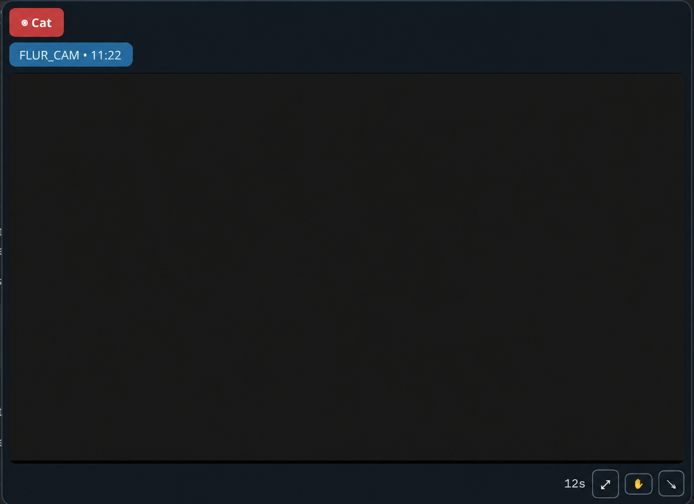
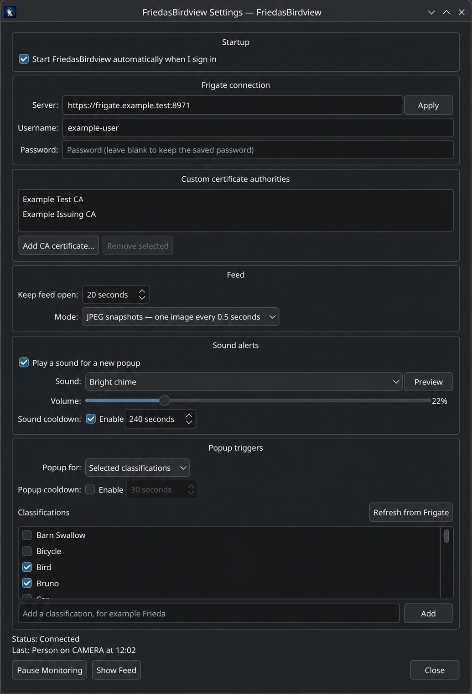

# FriedasBirdview


FriedasBirdview is a small desktop companion for Linux/KDE Plasma and Windows
11, compatible with [Frigate NVR](https://github.com/blakeblackshear/frigate).
When Frigate detects something you care about—such as a person, pet, bird, or
named animal—the app opens a temporary camera feed above your work without
taking keyboard focus.

> FriedasBirdview is an independent application compatible with Frigate. It is
> not affiliated with or endorsed by Frigate, Inc.

Built by [Marcel Kühn](AUTHORS.md) with OpenAI Codex (GPT-5.6 Terra, Extra High
reasoning).

The Frieda artwork in this repository was created from photographs supplied by
the project maintainer.



## What it does

- Watches recent Frigate events and review activity every two seconds.
- Can instead receive Frigate event and review updates over MQTT for lower
  delivery latency, while retaining HTTP polling as the no-setup default.
- Can start itself at sign-in through freedesktop XDG autostart on native
  Linux, the desktop Background portal in Flatpak, or the current-user Windows
  startup registry entry.
- Opens a movable, timed feed for selected classifications or any tracked
  object.
- Shows the detected label, confidence, camera, and countdown.
- Uses JPEG snapshots by default, with an authenticated low-latency go2rtc MSE
  live-stream option. On Linux, native MSE through Qt Multimedia and the system
  FFmpeg backend is the default; progressive MP4 and Qt WebEngine MSE remain
  selectable compatibility paths. Each safely falls back to JPEG if playback
  is unavailable, stalls, or repeatedly fails.
- Can play an opt-in, user-selected sound for a newly detected matching event.
- Offers independent, optional cooldowns for automatic popups and sound alerts.
- Stores an optional Frigate password in KDE Wallet on Linux or Windows
  Credential Manager on Windows; settings and the WebEngine profile do not
  persist passwords or session cookies.
- Remembers the feed window’s size and position without taking keyboard focus.
  In a Plasma Wayland session it uses the available Xwayland compatibility
  backend, because standard Wayland does not permit an app to restore an
  absolute top-level position.
- Shows connection-lost/restored notifications and a red tray icon when
  Frigate cannot be reached.

## Platforms and requirements

- **Linux:** KDE Plasma on a current Linux distribution, under Wayland or X11.
  Building from source requires CMake, a C++20 compiler, Qt 6 (Core, Gui,
  Widgets, Network, Multimedia, MultimediaWidgets, WebSockets, WebChannel,
  and WebEngineWidgets), a Qt Multimedia FFmpeg backend, and KF6 Wallet
  development packages.
- **Windows:** Windows 11 x64. The Setup installer includes Qt, the Microsoft
  C++ runtime, and OpenSSL; live video uses the Windows 11 WebView2 runtime,
  which is supplied and updated by Windows. No developer tools are needed.
- A reachable [Frigate NVR](https://github.com/blakeblackshear/frigate) server.
- A certificate the operating system trusts, or its issuing CA certificate for
  the in-app custom-CA picker. FriedasBirdview deliberately keeps normal TLS
  validation enabled.

On distributions that split development packages, install the Qt WebEngine and
KWallet development packages, OpenSSL development files, and the NSS
`certutil` tool in addition to the base Qt 6 and KF6 packages.

## Build from source on Linux

From this repository:

```sh
./build-and-install.sh
```

The script builds a release binary and installs it below `~/.local`. Log out
and back in, or refresh your Plasma application menu, if it does not appear
immediately. You can also run the binary directly from `build/friedasbirdview`.
Pass an alternative prefix as the script’s first argument if needed.

To choose another install location, use CMake directly:

```sh
cmake -S . -B build -DCMAKE_BUILD_TYPE=Release
cmake --build build --parallel
cmake --install build --prefix /your/chosen/prefix
```

## Packages

- **Windows 11:** download `FriedasBirdview-<version>-Setup-x64.exe` from the
  [latest GitHub Release](https://github.com/escapechen/FriedasBirdview/releases/latest),
  then run the installer. It includes all runtime dependencies and provides an
  uninstaller. Public installers are currently unsigned, so Windows may show a
  SmartScreen warning until public code signing is added.
- **Linux Flatpak bundle:** download
  [`friedasbirdview-x86_64.flatpak`](https://github.com/escapechen/FriedasBirdview/releases/latest/download/friedasbirdview-x86_64.flatpak)
  from the latest GitHub Release, then install it with
  `flatpak install --user ./friedasbirdview-x86_64.flatpak`.
- [Flatpak build and Flathub submission notes](docs/FLATPAK.md) — the
  cross-distribution package for KDE, GNOME, and other Linux desktops.
- [Gentoo ebuild and local-overlay instructions](docs/GENTOO.md).

## First-time setup



1. Start **FriedasBirdview** and open its tray icon’s **Settings**. Settings
   are grouped into compact **General**, **Feed & alerts**, **Triggers**,
   **Security**, and **Event delivery** tabs; the last selected tab is
   remembered.
2. On **General**, optionally enable **Start FriedasBirdview automatically when I sign in**.
   Native Linux installs use your desktop’s XDG autostart location, Flatpak
   installs ask the desktop’s Background portal for approval, and Windows uses
   the current user’s startup entry.
3. Enter the full Frigate base URL, including `https://` and any non-standard
   port, such as `https://frigate.example.net:8971`, then choose **Apply**.
   If the scheme is omitted, FriedasBirdview uses `https://`; an explicit
   `http://` address remains available only for a deliberately insecure local
   deployment.
4. If Frigate has login enabled, enter the username and password. The password
   is saved in KDE Wallet on Linux or Windows Credential Manager on Windows,
   not in the application settings. Leave Password empty when applying
   unrelated settings to retain the saved password.
5. If Frigate uses a private CA, open **Security** and add its public
   root/issuing CA certificate in **Custom certificate authorities**, then restart FriedasBirdview before
   using live video. This adds only that CA as a trust anchor; certificate
   host-name and expiry checks remain enabled.
6. Open **Feed & alerts** to set **Keep feed open** and select **JPEG snapshots** or **Live stream**.
   On Linux, choose **Native MSE** for the lowest-latency default. The
   progressive-MP4 and WebEngine choices are compatibility options. **Try next
   live player after** controls how long each live-player attempt has to
   produce a frame. JPEG starts immediately and remains visible while the app
   moves to the next compatible player or retries the selected one in the
   background; it switches to video only after a decoded frame arrives. The
   default is 5 seconds; use a shorter time for doorbell-like feeds or raise
   it when a camera has a slow key-frame interval. Enable **Write live-player
   diagnostics to terminal output** for concise state lines that omit server
   addresses, camera names, credentials, cookies, and tokens.
7. In **Event delivery**, keep **HTTP polling** for the compatible default or
   select **MQTT** for lower event-delivery latency. MQTT requires the broker
   host, port, TLS choice, topic prefix (normally `frigate`), and optionally a
   dedicated read-only broker account. Its password is stored only in KDE
   Wallet or Windows Credential Manager. Custom CAs from **Security** also
   apply to TLS MQTT connections. MQTT reduces app delivery delay but does not
   reduce Frigate's own detection or camera-stream startup time. Use **Test
   connection** after applying the settings to verify TLS, credentials, and
   both Frigate topic subscriptions without changing active monitoring.
8. With HTTP polling, enable **Fast event detection** for doorbell-like feeds. It checks Frigate
   once per second instead of every two seconds, at twice the API-polling load.
9. Optionally enable **Sound alerts**, then choose a sound and volume. Use
   **Preview** to test the selected alert.
10. Optionally enable a **Popup cooldown** or **Sound cooldown** and choose an
   interval from 1 second to 1 hour. Manual **Show Feed** and sound **Preview**
   remain available during a cooldown.
11. In **Triggers**, select **Selected classifications** and tick the labels/sub-labels that
   should open a feed, or choose **Any tracked object**.
12. Use **Refresh from Frigate** to retrieve known labels and sub-labels. You
   can always add a custom name, for example `Frieda`.

Fresh installs use the intentionally unreachable `https://frigate.invalid`
placeholder. A connection failure leaves the app running with the disconnected
tray state; it never terminates the app.

## Using the feed

- Click the image or video to dismiss it early.
- The lower-right countdown shows the automatic dismissal time.
- Drag the hand control to move the window.
- Use the diagonal-arrow button to enlarge or restore the feed.
- The requested position and size are preserved. In a Plasma Wayland session,
  FriedasBirdview uses Xwayland automatically when it is available so the
  saved position can be restored without manual KWin rules.

For **Live stream**, the selected camera needs a working Frigate/go2rtc MSE
restream and a codec the platform player can play. FriedasBirdview uses the Frigate
configuration mapping `cameras.<camera>.live.streams`; a camera name is not
assumed to be the go2rtc stream name. No extra Frigate ports, RTSP credentials,
or per-camera restream configuration is required. Linux opens the native MSE
relay first by default because it avoids progressive HTTP's added latency while
still using Qt Multimedia's system FFmpeg decoder. Progressive MP4 and Qt
WebEngine MSE can be selected for compatibility. All paths ultimately fall
back to **JPEG snapshots** after incompatible, stalled, or repeatedly failed
playback. Windows uses Edge WebView2 for live
playback, so it uses the H.264 support already maintained by Windows rather
than bundling a proprietary codec library.

## Important Frigate distinction

Birdseye’s **continuous**, **motion**, and **objects** modes decide what
Frigate draws in its Birdseye mosaic. They do not create a FriedasBirdview
popup by themselves. FriedasBirdview reacts to new Frigate event and review
records and filters them by object classification.

## Troubleshooting

| Problem | What to check |
| --- | --- |
| Tray icon is red | Confirm the URL, Frigate availability, TLS trust, and login details. |
| No popup | Confirm monitoring is running. Temporarily choose **Any tracked object**, then inspect the tray menu’s last activity. |
| MQTT does not connect | Confirm Frigate is configured for MQTT, the broker host/port and topic prefix are correct, and the broker account can subscribe to `<prefix>/events` and `<prefix>/reviews`. Prefer TLS; add its issuing CA in **Security** if needed. |
| A new event did not reopen the feed or play a sound | Check whether the respective cooldown is enabled and has not yet elapsed. |
| A name never triggers | Add the exact event label or sub-label reported by Frigate. A Birdseye image without a new event does not count. |
| Password cannot be saved | On Linux, enable and unlock KDE Wallet; on Windows, check Credential Manager access for the current user. Then apply the settings again. |
| The app does not start after sign-in | Confirm the **Startup** switch is enabled. Linux native installs use XDG autostart, Flatpak requires desktop Background portal approval, and Windows uses the current user’s startup entry. Re-enable after moving a native Linux executable. |
| No sound is heard | Enable **Sound alerts**, use **Preview**, and check the desktop output device and volume. |
| Private CA works for JPEG but not live video on Windows | WebView2 trusts the Windows Current User certificate store. Import Frigate’s issuing CA there; FriedasBirdview never bypasses certificate validation. Linux native packages use the private NSS database, and the Flatpak includes `certutil`. |
| Live stream switches to JPEG | Confirm the stream plays in Frigate and a compatible go2rtc codec is available. On Linux, start with **Native MSE**; the progressive-MP4 and Qt WebEngine options are available for compatibility testing. |
| Feed is on the wrong screen | Drag it to the intended display once. On Wayland placement is ultimately controlled by KWin. |

## Project notes

- [Linux source-build details](docs/BUILD_FROM_SOURCE.md)
- [Windows build, installer, and release details](docs/WINDOWS_PORT.md)
- [Release process and versioning](docs/RELEASING.md)
- [Flatpak package](docs/FLATPAK.md)
- [Gentoo ebuild and local-overlay instructions](docs/GENTOO.md)
- [Changelog](CHANGELOG.md)
- [Third-party notices](THIRD_PARTY_NOTICES.md)
- [Contributors](AUTHORS.md)

FriedasBirdview is licensed under the [MIT License](LICENSE). Frigate-derived
MSE handling and the OpenSSL X.509 API use are covered by the attribution in
[THIRD_PARTY_NOTICES.md](THIRD_PARTY_NOTICES.md).
